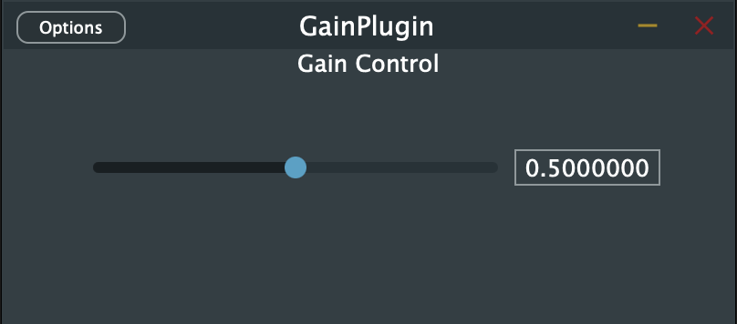

# DSP Gain Plugin

A simple audio gain plugin built with JUCE framework, supporting AU and VST3 formats on macOS.



## Features
- Gain control (0% to 100%)
- AU and VST3 formats
- macOS compatibility (ARM64/x86_64)
- Resizable UI

## Requirements
- macOS 10.14+
- [JUCE 6.0+](https://juce.com)
- Xcode 12+
- CMake 3.15+ (optional)

## Installation
### Method 1: Pre-built Binaries
1. Download the latest release
2. Place plugin files in:
   ```
   ~/Library/Audio/Plug-Ins/VST3/GainPlugin.vst3
   ~/Library/Audio/Plug-Ins/Components/GainPlugin.component
   ```
3. Rescan plugins in your DAW

### Method 2: Build from Source
```bash
git clone https://github.com/omega1119/dsp-gain-plugin.git
cd dsp-gain-plugin

# Using Projucer:
open GainPlugin.jucer  # Export for your IDE

# Or using CMake:
mkdir build && cd build
cmake .. -DCMAKE_BUILD_TYPE=Release
cmake --build .
```

## Project Structure
```
dsp-gain-plugin/
├── Builds/               # Build system files
├── JuceLibraryCode/      # Auto-generated configs
├── Source/               # Core source files
│   ├── PluginProcessor.h # Audio processing
│   ├── PluginProcessor.cpp
│   ├── PluginEditor.h    # GUI
│   └── PluginEditor.cpp
├── README.md             # This file
└── GainPlugin.jucer      # JUCE project file
```

## Development Notes
### Key Parameters
- **Gain Range**: 0.0 (silent) to 1.0 (full volume)
- **Default Value**: 0.5 (-6dB)

### Adding New Features
1. **Add parameters**:
   ```cpp
   // In PluginProcessor.h
   juce::AudioParameterFloat* gainParam;
   ```
2. **Implement presets**:
   Override `getStateInformation()`/`setStateInformation()`

## Troubleshooting
| Issue | Solution |
|-------|----------|
| Plugin not showing in DAW | Run `sudo auval -reset` |
| Build failures | Clean build folder and regenerate project |
| UI glitches | Verify all `resized()` implementations |

## License
[MIT License](LICENSE) - Free for personal and commercial use

---

*Created with [JUCE](https://juce.com) framework*